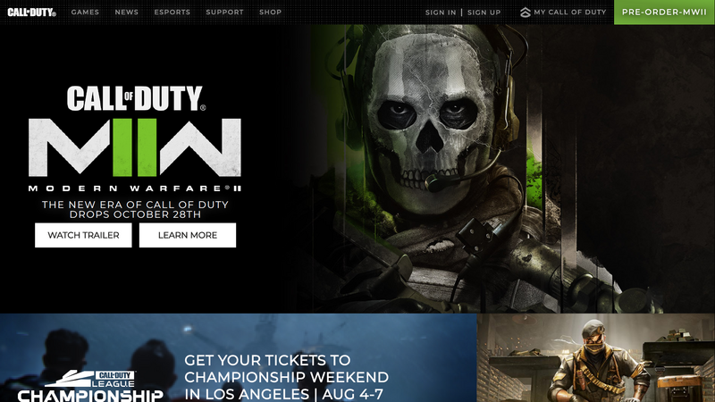
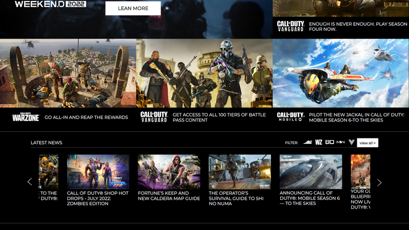
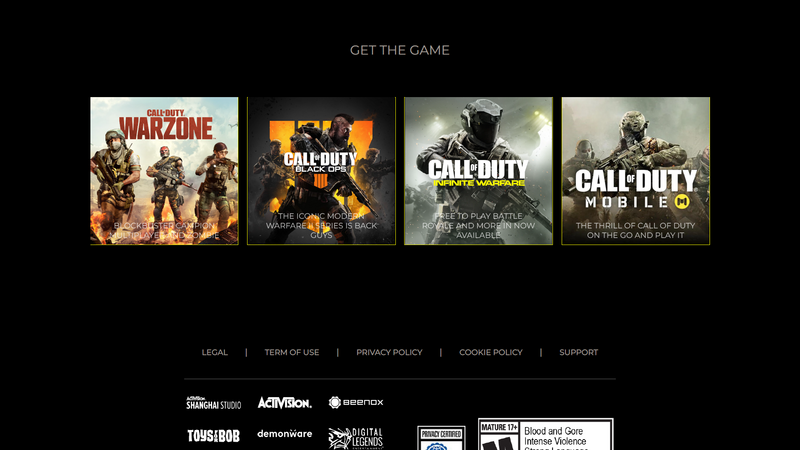
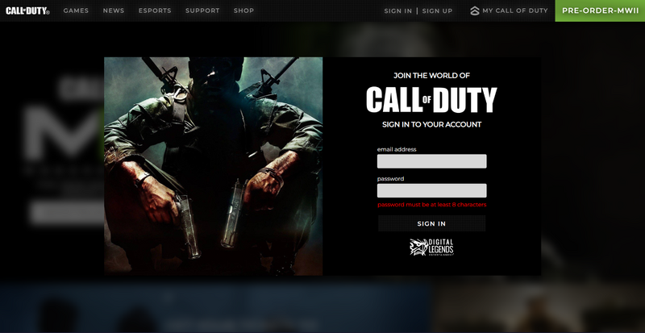

# what is this?
This is a project to practice React that I code from the Call of Duty site.The technologies I have used are React, css, JSX and... .My main goal for this project is to practice from beginner in React.The project is constantly being updated. I hope you enjoy it.

# Attributes:
- full responsive
- diynamic components
- modern design css

# sections:
- header
  - modal
    - sign in modal
    - sign up modal
- Main part
- Landing part
- news grid-box
- news slider
- game box
- footer

# preview

# Modal sign in

# Modal sign up

https://ehsanshahbazii.github.io/Call-Of-Duty/
